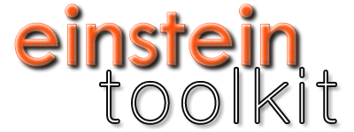

# North American Einstein Toolkit School 2021
Date: TBD 
Venue: Online event.

We are pleased to announce the 2021 edition of the North American
Einstein Toolkit Workshop. The Workshop to be held at the University of
Illinois will provide an opportunity for researchers and students to
learn about the [Einstein Toolkit](https://einsteintoolkit.org/), a
community-driven software platform of core computational tools to advance
and support research in relativistic astrophysics and gravitational
physics.

The workshop will offer a mixture of talks and tutorials, with the
tutorials including basic tutorials for new users and more advanced
topics. The talks will, likewise, provide information for new users and
will highlight exciting science cases and the latest developments in
numerical relativity. On the final day, we will discuss future directions
and development

## How to View
Connection information will be mailed to you once you [register](register.html).
Recordings will be made available in the
[Einstein Toolkit Youtube channel](https://www.youtube.com/channel/UC8IObWZ7_wEbWnbIKVIQRYQ).

## Sponsored by
{: class="textwrapright" style='height: 4em' }
NSF [OAC-2004879](https://nsf.gov/awardsearch/showAward?AWD_ID=2004879&HistoricalAwards=false) "The Einstein Toolkit ecosystem: Enabling fundamental research in the era of multi-messenger astrophysics".

